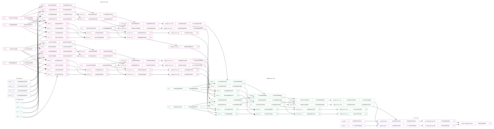
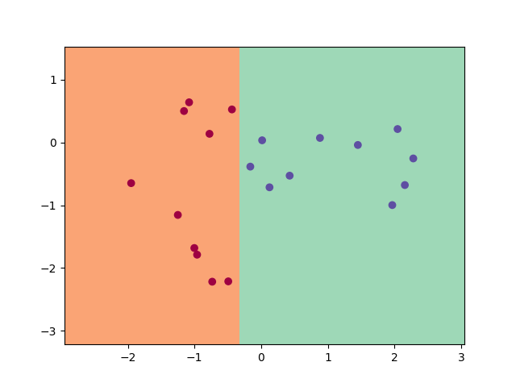
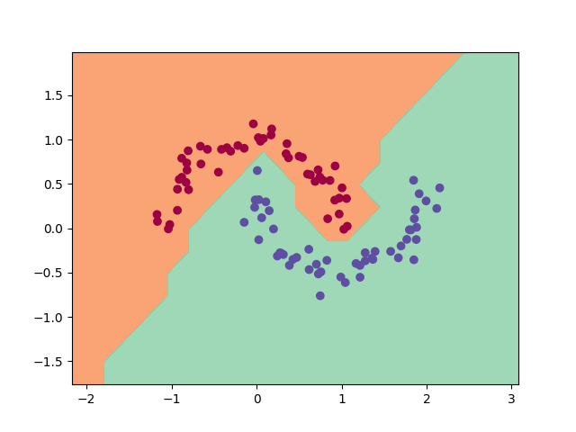
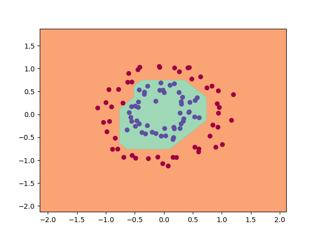
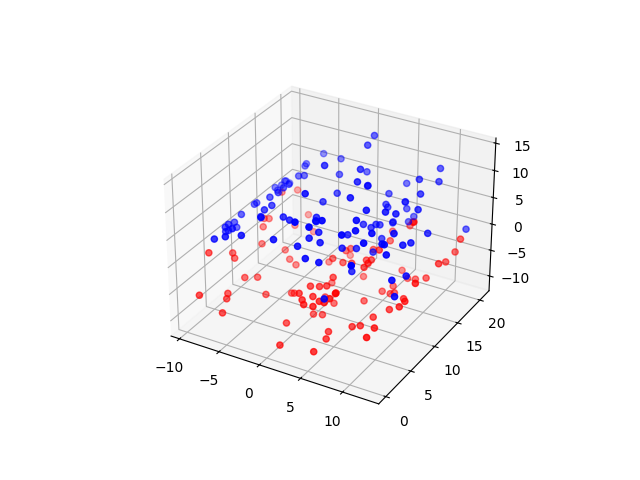

# Kana.rs: Tiny Rust Neural Network Framework for Python

[](https://github.com/lascauje/kanars/actions/workflows/kanars_build.yml) [](https://github.com/lascauje/kanars/actions/workflows/kanars_release.yml)


- Basic Rust Code
- Simple Python API
- Fully Introspective
- Linear & Non-Linear Classification
- Kanars, pronounced "canard" (a duck in French)

## Examples

### Basic

[source code](./examples/test_kanars.py)

```python
import kanars as ks

x_data = [[3.0, 2.0], [-2.0, -1.0]]
y_target = [1.0, -1.0]
x_pred = [[3.5, 2.5], [-2.5, -1.5]]

nn = ks.NeuralNet()

y_pred = (
    nn.model(layers=[2, 2, 1])
    .train(x_data, y_target, nb_iter=5, learning_rate=0.01, debug=True)
    .summary()
    .draw("kanars.dot")
    .predict(x_pred)
)
```

```bash
Step 0: Loss 1.7603056536236572
Step 1: Loss 1.1486407429701702
Step 2: Loss 0.8433338318839578
Step 3: Loss 0.6659423674362334
Step 4: Loss 0.5505422859628918
```

```bash
~~ Summary ~~
Layer(2x2)
         TanhNeuron(2)
         TanhNeuron(2)
Layer(2x1)
         TanhNeuron(2)
Number of parameters 9
```



### Linear

[source code](./examples/test_kanars.py)

```python
# [...]
nn = ks.NeuralNet()

(
    nn.model(layers=[2, 2, 1])
    .train(x_data, y_target, nb_iter=100, learning_rate=0.01, debug=False)
    .summary()
)

plot_decision_boundary(nn, x_data, y_target, "kanars_plot.png")
# [...]
```

```bash
~~ Summary ~~
Layer(2x2)
         TanhNeuron(2)
         TanhNeuron(2)
Layer(2x1)
         TanhNeuron(2)
Number of parameters 9
```



### Moons

[source code](./examples/test_kanars.py)

```python
# [...]
nn = ks.NeuralNet()

(
    nn.model(layers=[2, 4, 4, 1])
    .train(x_data, y_target, nb_iter=1000, learning_rate=0.01, debug=False)
    .summary()
)

plot_decision_boundary(nn, x_data, y_target, "kanars_plot.png")
# [...]
```

```bash
~~ Summary ~~
Layer(2x4)
         TanhNeuron(2)
         TanhNeuron(2)
         TanhNeuron(2)
         TanhNeuron(2)
Layer(4x4)
         TanhNeuron(4)
         TanhNeuron(4)
         TanhNeuron(4)
         TanhNeuron(4)
Layer(4x1)
         TanhNeuron(4)
Number of parameters 37
```



### Circle

[source code](./examples/test_kanars.py)

```python
# [...]
nn = ks.NeuralNet()

(
    nn.model(layers=[2, 4, 4, 1])
    .train(x_data, y_target, nb_iter=1000, learning_rate=0.01, debug=False)
    .summary()
)

plot_decision_boundary(nn, x_data, y_target, "kanars_plot.png")
# [...]
```

```bash
~~ Summary ~~
Layer(2x4)
         TanhNeuron(2)
         TanhNeuron(2)
         TanhNeuron(2)
         TanhNeuron(2)
Layer(4x4)
         TanhNeuron(4)
         TanhNeuron(4)
         TanhNeuron(4)
         TanhNeuron(4)
Layer(4x1)
         TanhNeuron(4)
Number of parameters 37
```



### 3D

[source code](./examples/test_kanars.py)

```python
# [...]
nn = ks.NeuralNet()

y_pred = (
    nn.model(layers=[3, 8, 4, 1])
    .train(x_data, y_target, nb_iter=500, learning_rate=0.001, debug=False)
    .summary()
    .predict([[5, 3, -1], [-2, -4, 1]])
)

# boundary is z=0
print(y_pred)
# [...]
```

```bash
~~ Summary ~~
Layer(3x8)
         TanhNeuron(3)
         TanhNeuron(3)
         TanhNeuron(3)
         TanhNeuron(3)
         TanhNeuron(3)
         TanhNeuron(3)
         TanhNeuron(3)
         TanhNeuron(3)
Layer(8x4)
         TanhNeuron(8)
         TanhNeuron(8)
         TanhNeuron(8)
         TanhNeuron(8)
Layer(4x1)
         TanhNeuron(4)
Number of parameters 73
```

```bash
[-0.9853655432148967, 0.9763794028388694]
```



## Installation

```bash
❯ wget https://github.com/lascauje/kanars/releases/download/v0.1.0/kanars-0.1.0-<arch>.whl
```

```bash
❯ pip install kanars-0.1.0-<arch>.whl
```

```bash
❯ python -c "import kanars as ks; ks.hello()"
quack!
```

## Building

See [kanars_build.yml](./.github/workflows/kanars_build.yml)

## Reference

Andrej Karpathy. 2020. [Micrograd](https://github.com/karpathy/micrograd)
